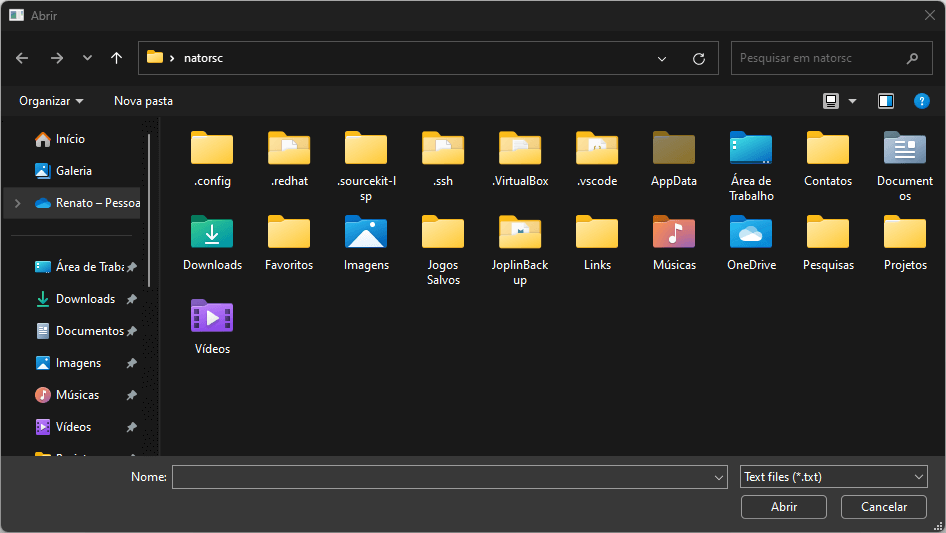
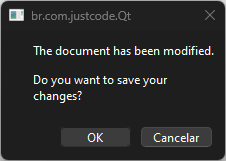
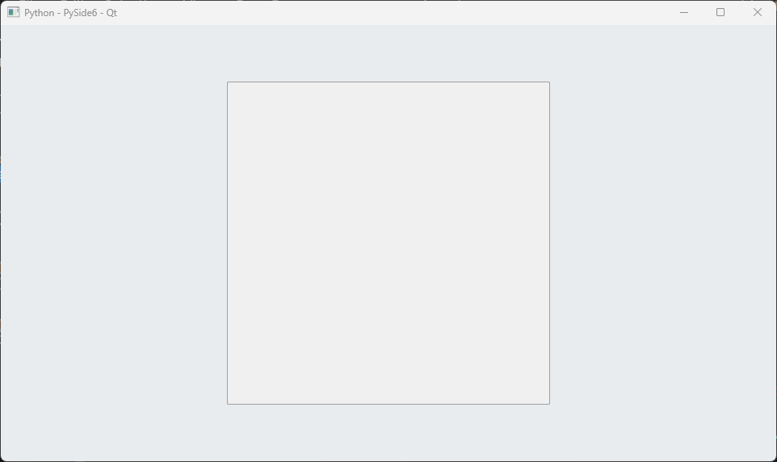
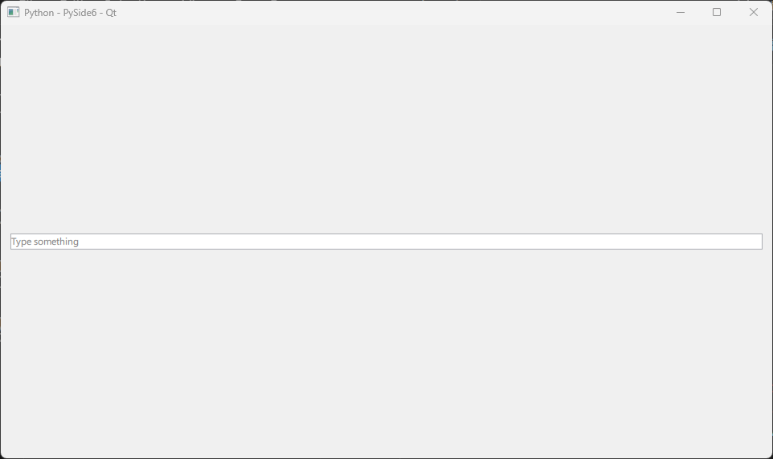
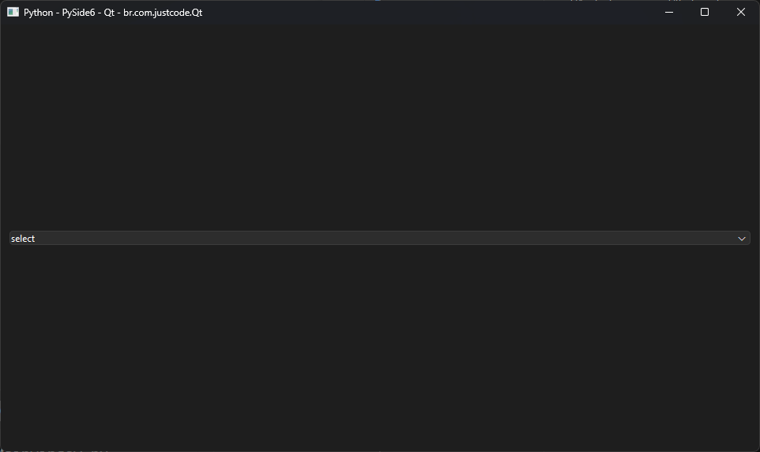
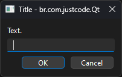
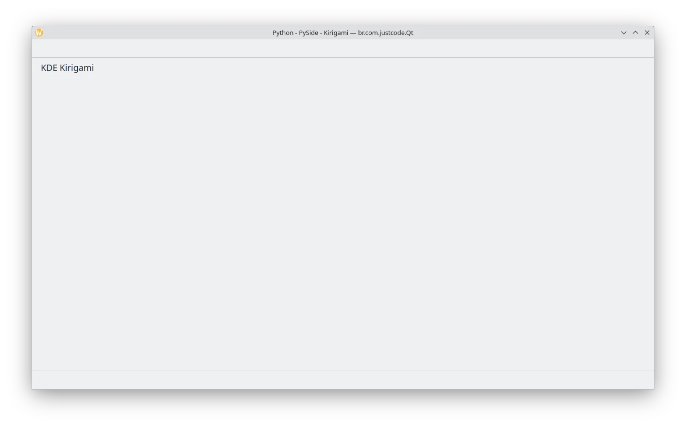
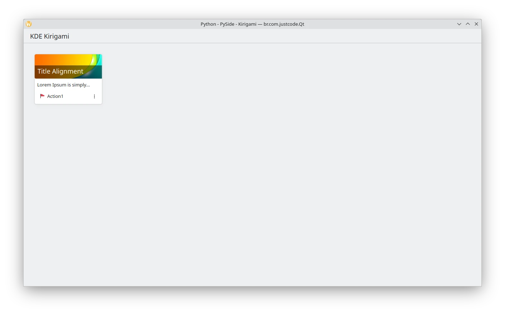

 and Qt")

<br>

# Creating Graphical Interfaces with Python and Qt

[](https://github.com/natorsc/py-qt "Acessar o repositório.")
&emsp;
[](https://github.com/natorsc/py-qt)
&emsp;
[](https://github.com/natorsc/py-qt)

[](LICENSE)

## 📝 Description

This repository is dedicated to consolidating tips, tutorials, and code examples for building graphical interfaces using [Python](https://www.python.org/) (PySide6) and the [Qt](https://www.qt.io/) graphical framework.

---

## 🤓 Author

Repository created with 💙 by [Renato Cruz](https://github.com/natorsc) 🤜🤛 Feel free to reach out!

[](mailto:natorsc@gmail.com "Send an email.")

Check out programming and technology content on:

[](https://justcode.com.br/ "Visit the justCode blog.")

[](https://justcode.com.br/ "Visit the justCode blog.")

A playlist I often listen to while studying or coding 😁:

[](https://open.spotify.com/playlist/1xf3u29puXlnrWO7MsaHL5?si=A-LgwRJXSvOno_e6trpi5w&utm_source=copy-link "Access the playlist.")

---

## 💝 Donations

Thank you for your donation, it's through your support that I can maintain this content 😊.

### Github

https://github.com/sponsors/natorsc/

### Pix (Brazil)

**Key**: `b1839493-2afe-484d-9272-82a3e402b36f`

---

## 💡 Extras

### Qt

- [Qt 6 Documentation](https://doc.qt.io/qt-6/).

### Kirigami

- [Kirigami](https://api.kde.org/frameworks/kirigami/html/).

### KDE

- [Official website](https://kde.org/).

### Software

- [KDE Apps](https://apps.kde.org/).

### Flatpak

- [Flathub](https://flathub.org/).
- [Flatpak](https://www.flatpak.org/).

---

## table of contents

- [Qt quick](#qt-quick).
- [Qt widgets](#qt-widgets).
- [KDE Kirigami](#kde-kirigami).

## Qt quick

### Application window


**Code**:

- [Python](src/qt-quick/application-window/main.py).
- [QML](src/qt-quick/application-window/main.qml).

### Busy indicator


**Code**:

- [Python](src/qt-quick/busy-indicator/main.py).
- [QML](src/qt-quick/busy-indicator/main.qml).

### Button


**Code**:

- [Python](src/qt-quick/button/main.py).
- [QML](src/qt-quick/button/main.qml).

### Button group


**Code**:

- [Python](src/qt-quick/button-group/main.py).
- [QML](src/qt-quick/button-group/main.qml).

### Charts

#### Area series


**Code**:

[Python](src/qt-quick/charts/area-series/main.py)
[QML](src/qt-quick/charts/area-series/main.qml)

#### Bar series


**Code**:

[Python](src/qt-quick/charts/bar-series/main.py)
[QML](src/qt-quick/charts/bar-series/main.qml)

#### Horizontal bar series


**Code**:

[Python](src/qt-quick/charts/horizontal-bar-series/main.py)
[QML](src/qt-quick/charts/horizontal-bar-series/main.qml)

#### Horizontal percent bar series


**Code**:

[Python](src/qt-quick/charts/horizontal-percent-bar-series/main.py)
[QML](src/qt-quick/charts/horizontal-percent-bar-series/main.qml)

#### Horizontal stacked bar series


**Code**:

[Python](src/qt-quick/charts/horizontal-stacked-bar-series/main.py)
[QML](src/qt-quick/charts/horizontal-stacked-bar-series/main.qml)

#### Line series


**Code**:

[Python](src/qt-quick/charts/line-series/main.py)
[QML](src/qt-quick/charts/line-series/main.qml)

#### Percent bar series


**Code**:

[Python](src/qt-quick/charts/percent-bar-series/main.py)
[QML](src/qt-quick/charts/percent-bar-series/main.qml)

#### Pie donut series


**Code**:

[Python](src/qt-quick/charts/pie-donut-series/main.py)
[QML](src/qt-quick/charts/pie-donut-series/main.qml)

#### Pie series


**Code**:

[Python](src/qt-quick/charts/pie-series/main.py)
[QML](src/qt-quick/charts/pie-series/main.qml)

#### Scatter series


**Code**:

[Python](src/qt-quick/charts/scatter-series/main.py)
[QML](src/qt-quick/charts/scatter-series/main.qml)

#### Spline series


**Code**:

[Python](src/qt-quick/charts/spline-series/main.py)
[QML](src/qt-quick/charts/spline-series/main.qml)

#### Stacked bar series


**Code**:

[Python](src/qt-quick/charts/stacked-bar-series/main.py)
[QML](src/qt-quick/charts/stacked-bar-series/main.qml)

### Check box


**Code**:

- [Python](src/qt-quick/check-box/main.py).
- [QML](src/qt-quick/check-box/main.qml).

### Check delegate


**Code**:

- [Python](src/qt-quick/check-delegate/main.py).
- [QML](src/qt-quick/check-delegate/main.qml).

### Column layout


**Code**:

- [Python](src/qt-quick/column-layout/main.py).
- [QML](src/qt-quick/column-layout/main.qml).

### Combo box


**Code**:

- [Python](src/qt-quick/combo-box/main.py).
- [QML](src/qt-quick/combo-box/main.qml).

### Day of week row


**Code**:

- [Python](src/qt-quick/day-of-week-row/main.py).
- [QML](src/qt-quick/day-of-week-row/main.qml).

### Delay button


**Code**:

- [Python](src/qt-quick/delay-button/main.py).
- [QML](src/qt-quick/delay-button/main.qml).

### Dial


**Code**:

- [Python](src/qt-quick/dial/main.py).
- [QML](src/qt-quick/dial/main.qml).

### Dialog


**Code**:

- [Python](src/qt-quick/dialog/main.py).
- [QML](src/qt-quick/dialog/main.qml).

### Drawer


**Code**:

- [Python](src/qt-quick/drawer/main.py).
- [QML](src/qt-quick/drawer/main.qml).

### Frame


**Code**:

- [Python](src/qt-quick/frame/main.py).
- [QML](src/qt-quick/frame/main.qml).

### Grid Layout


**Code**:

- [Python](src/qt-quick/grid-layout/main.py).
- [QML](src/qt-quick/grid-layout/main.qml).

### Group box


**Code**:

- [Python](src/qt-quick/group-box/main.py).
- [QML](src/qt-quick/group-box/main.qml).

### Item delegate


**Code**:

- [Python](src/qt-quick/item-delegate/main.py).
- [QML](src/qt-quick/item-delegate/main.qml).

### Labs

#### Color dialog


**Code**:

- [Python](src/qt-quick/labs/color-dialog/main.py).
- [QML](src/qt-quick/labs/color-dialog/main.qml).

#### File dialog



**Code**:

- [Python](src/qt-quick/labs/file-dialog/main.py).
- [QML](src/qt-quick/labs/file-dialog/main.qml).

#### Folder dialog


**Code**:

- [Python](src/qt-quick/labs/folder-dialog/main.py).
- [QML](src/qt-quick/labs/folder-dialog/main.qml).

#### Font dialog


**Code**:

- [Python](src/qt-quick/labs/font-dialog/main.py).
- [QML](src/qt-quick/labs/font-dialog/main.qml).

#### Message dialog



**Code**:

- [Python](src/qt-quick/labs/message-dialog/main.py).
- [QML](src/qt-quick/labs/message-dialog/main.qml).

### Layout item proxy


**Code**:

- [Python](src/qt-quick/layout-item-proxy/main.py).
- [QML](src/qt-quick/layout-item-proxy/main.qml).

### Overlay



**Code**:

- [Python](src/qt-quick/overlay/main.py).
- [QML](src/qt-quick/overlay/main.qml).

### Row layout


**Code**:

- [Python](src/qt-quick/row-layout/main.py).
- [QML](src/qt-quick/row-layout/main.qml).

### Stack layout


**Code**:

- [Python](src/qt-quick/stack-layout/main.py).
- [QML](src/qt-quick/stack-layout/main.qml).

### Text field



**Code**:

- [Python](src/qt-quick/text-field/main.py).
- [QML](src/qt-quick/text-field/main.qml).

### Text input


**Code**:

- [Python](src/qt-quick/text-input/main.py).
- [QML](src/qt-quick/text-input/main.qml).

### Translation


**Code**:

- [Python](src/qt-quick/translation/main.py).
- [QML](src/qt-quick/translation/main.qml).

### Tree view


**Code**:

- [Python](src/qt-quick/tree-view/main.py).
- [QML](src/qt-quick/tree-view/main.qml).


---

## Qt widgets

### QApplication


**Code**:

- [Python](src/qt-widgets/qapplication/MainWindow.py).

### QBoxLayout


**Code**:

- [Python](src/qt-widgets/qboxlayout/MainWindow.py).

### QButtonGroup


**Code**:

- [Python](src/qt-widgets/qbuttongroup/MainWindow.py).

### QCalendarWidget


**Code**:

- [Python](src/qt-widgets/qcalendarwidget/MainWindow.py).

### QCheckBox


**Code**:

- [Python](src/qt-widgets/qcheckbox/MainWindow.py).

### QColorDialog


**Code**:

- [Python](src/qt-widgets/qcolordialog/MainWindow.py).

### QColumnView


**Code**:

- [Python](src/qt-widgets/qcolumnview/MainWindow.py).

### QComboBox



**Code**:

- [Python](src/qt-widgets/qcombobox/MainWindow.py).

### QCompleter


**Code**:

- [Python](src/qt-widgets/qcompleter/MainWindow.py).

### QDateEdit


**Code**:

- [Python](src/qt-widgets/qdateedit/MainWindow.py).

### QDateTimeEdit


**Code**:

- [Python](src/qt-widgets/qdatetimeedit/MainWindow.py).

### QDial


**Code**:

- [Python](src/qt-widgets/qdial/MainWindow.py).

### QDialog


**Code**:

- [Python](src/qt-widgets/qdialog/MainWindow.py).

### QDialogButtonBox


**Code**:

- [Python](src/qt-widgets/qdialogbuttonbox/MainWindow.py).

### QDockWidget


**Code**:

- [Python](src/qt-widgets/qdockwidget/MainWindow.py).

### QDoubleSpinBox


**Code**:

- [Python](src/qt-widgets/qdoublespinbox/MainWindow.py).

### QErrorMessage


**Code**:

- [Python](src/qt-widgets/qerrormessage/MainWindow.py).

### QFileDialog


**Code**:

- [Python](src/qt-widgets/qfiledialog/MainWindow.py).

### QFontComboBox


**Code**:

- [Python](src/qt-widgets/qfontcombobox/MainWindow.py).

### QFontDialog


**Code**:

- [Python](src/qt-widgets/qfontdialog/MainWindow.py).

### QFormLayout


**Code**:

- [Python](src/qt-widgets/qformlayout/MainWindow.py).

### QFrame


**Code**:

- [Python](src/qt-widgets/qframe/MainWindow.py).

### QGridLayout


**Code**:

- [Python](src/qt-widgets/qgridlayout/MainWindow.py).

### QGroupBox


**Code**:

- [Python](src/qt-widgets/qgroupbox/MainWindow.py).

### QHBoxLayout


**Code**:

- [Python](src/qt-widgets/qhboxlayout/MainWindow.py).

### QInputDialog



**Code**:

- [Python](src/qt-widgets/qinputdialog/MainWindow.py).

### QLabel


**Code**:

- [Python](src/qt-widgets/qlabel/MainWindow.py).

### QLCDNumber


**Code**:

- [Python](src/qt-widgets/qlcdnumber/MainWindow.py).

### QLineEdit


**Code**:

- [Python](src/qt-widgets/qlineedit/MainWindow.py).

### QListView


**Code**:

- [Python](src/qt-widgets/qlistview/MainWindow.py).

### QListWidget


**Code**:

- [Python](src/qt-widgets/qlistwidget/MainWindow.py).

### QMainWindow


**Code**:

- [Python](src/qt-widgets/qmainwindow/MainWindow.py).

### QMenu


**Code**:

- [Python](src/qt-widgets/qmenu/MainWindow.py).

### QSystemTrayIcon


**Code**:

- [Python](src/qt-widgets/QSystemTrayIcon/MainWindow.py).

---

## KDE Kirigami

> Don't use PySide6 by installing it in a virtual environment, install it through your Linux distro's package manager.
> Otherwise the following error will be displayed: `module "org.kde.kirigami" is not installed`.

### Install Kirigami

#### Arch Linux

**PySide6**:

```bash
sudo pacman -S \
pyside6 \
kirigami \
flatpak-builder \
qqc2-desktop-style \
appstream
```

**PyQt6**:

```bash
sudo pacman -S \
python-pyqt6 \
kirigami \
flatpak-builder \
qqc2-desktop-style \
appstream
```

#### openSUSE

**PySide6**:

```bash
sudo zypper install \
python3-pyside6 \
kf6-kirigami-devel \
flatpak-builder \
qqc2-desktop-style \
AppStream-compose
```

**PyQt6**:

```bash
sudo zypper install \
python3-PyQt6 \
kf6-kirigami-devel \
flatpak-builder \
qqc2-desktop-style \
AppStream-compose
```

#### Fedora

**PySide6**:

```bash
sudo dnf install \
python3-pyside6 \
kf6-kirigami-devel \
flatpak-builder \
qqc2-desktop-style \
appstream-compose
```

**PyQt6**:

```bash
sudo dnf install \
python3-pyqt6 \
kf6-kirigami-devel \
flatpak-builder \
qqc2-desktop-style \
appstream-compose
```

### Abstract card


**Code**:

- [Python](src/kde-kirigami/abstract-card/main.py).
- [QML](src/kde-kirigami/abstract-card/main.qml).

### Application window 



**Code**:

- [Python](src/kde-kirigami/application-window/main.py).
- [QML](src/kde-kirigami/application-window/main.qml).

### Card



**Code**:

- [Python](src/kde-kirigami/card/main.py).
- [QML](src/kde-kirigami/card/main.qml).

### Chips


**Code**:

- [Python](src/kde-kirigami/chips/main.py).
- [QML](src/kde-kirigami/chips/main.qml).

### Dialog


**Code**:

- [Python](src/kde-kirigami/dialog/main.py).
- [QML](src/kde-kirigami/dialog/main.qml).

### Dialog menu


**Code**:

- [Python](src/kde-kirigami/dialog-menu/main.py).
- [QML](src/kde-kirigami/dialog-menu/main.qml).

### Dialog prompt


**Code**:

- [Python](src/kde-kirigami/dialog-prompt/main.py).
- [QML](src/kde-kirigami/dialog-prompt/main.qml).

### Global drawer


**Code**:

- [Python](src/kde-kirigami/global-drawer/main.py).
- [QML](src/kde-kirigami/global-drawer/main.qml).

### Global drawer context


**Code**:

- [Python](src/kde-kirigami/global-drawer-context/main.py).
- [QML](src/kde-kirigami/global-drawer-context/main.qml).

### Global drawer desktop


**Code**:

- [Python](src/kde-kirigami/global-drawer-desktop/main.py).
- [QML](src/kde-kirigami/global-drawer-desktop/main.qml).

### Global drawer header


**Code**:

- [Python](src/kde-kirigami/global-drawer-header/main.py).
- [QML](src/kde-kirigami/global-drawer-header/main.qml).

### Global drawer header


**Code**:

- [Python](src/kde-kirigami/overlay-drawer/main.py).
- [QML](src/kde-kirigami/overlay-drawer/main.qml).

### Overlay drawer


**Code**:

- [Python](src/kde-kirigami/overlay-drawer/main.py).
- [QML](src/kde-kirigami/overlay-drawer/main.qml).
